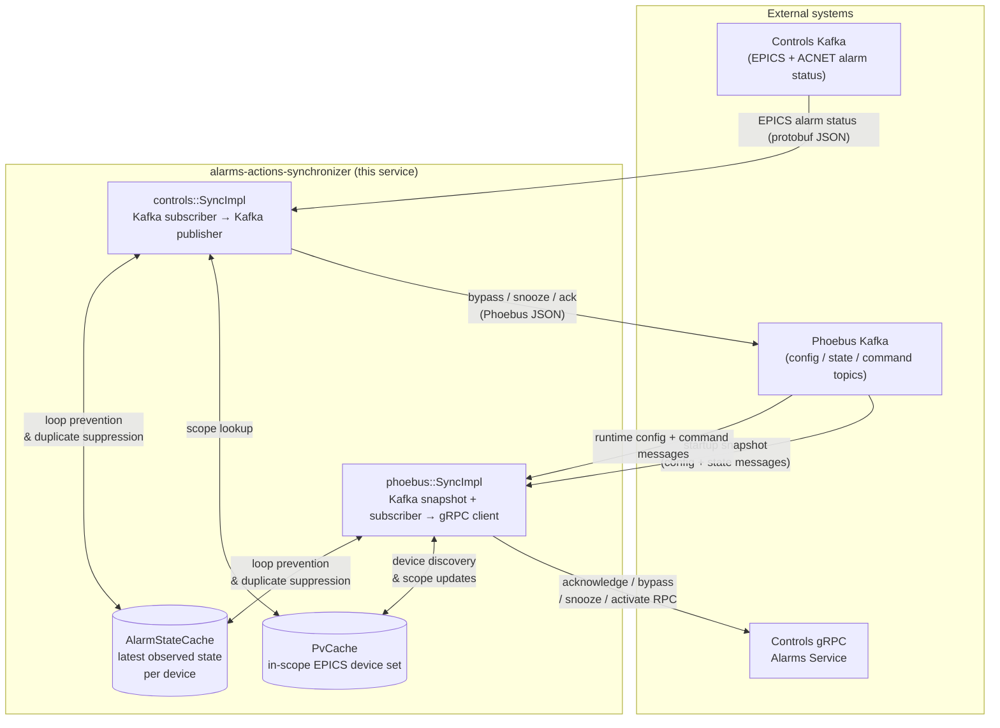
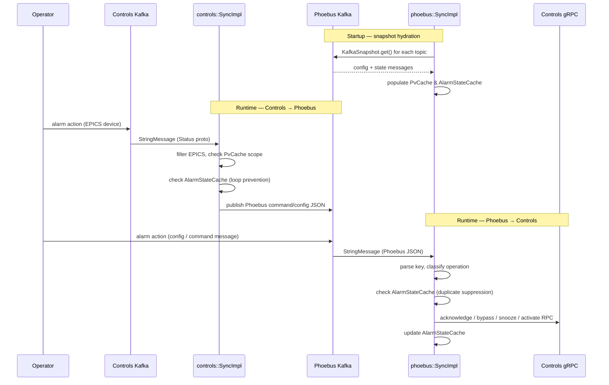

# Alarms Synchronizer

An application to watch the Controls and Phoebus alarms servers and pass user actions between them.

## Architecture

### Data-flow summary

## Architecture notes

This binary runs two long-lived synchronizers in parallel:

- [`controls::SyncImpl`](src/controls/mod.rs) watches Controls Kafka and mirrors synchronization-relevant EPICS alarm actions into Phoebus Kafka.
- [`phoebus::SyncImpl`](src/phoebus/mod.rs) hydrates from Phoebus Kafka at startup, then watches Phoebus Kafka and mirrors supported user actions into the Controls alarms gRPC service.

### System role in the larger alarms landscape

The Controls alarm service acts as a hybrid UI/backend over two alarm worlds:

- a legacy ACNET alarms path that this synchronizer does not manage
- a Phoebus/EPICS alarms path that this synchronizer does manage

This service therefore focuses only on EPICS alarm-handling intent that can appear in both systems.

### In-scope devices

An EPICS device is in scope only when Phoebus has emitted configuration metadata for it.

- The Phoebus configuration record is the source-of-truth boundary for whether an EPICS device matters to this service.
- Controls-side EPICS updates without matching Phoebus metadata are treated as out of scope, not as missing data that should be retried indefinitely.
- The [`PvCache`](src/models/mod.rs) is therefore more than a convenience cache: it is the synchronizer's runtime record of which devices are eligible for synchronization.
- New devices can become in scope at runtime when Phoebus emits new configuration records after startup.

### Cache roles

The service currently uses two shared caches with distinct meanings:

- [`PvCache`](src/models/mod.rs): tracks the latest Phoebus configuration metadata for each in-scope EPICS device and therefore defines the in-scope device set.
- [`AlarmStateCache`](src/models/mod.rs): tracks the latest in-scope alarm-handling state observed by the synchronizer for loop prevention and duplicate suppression.

`AlarmStateCache` does **not** mean "latest successfully mirrored state". It records the latest observed in-scope state even when an outbound publish or RPC attempt fails, because that local memory helps prevent synchronization echo loops.

### Anti-corruption boundary for third-party Kafka JSON

[`src/models/phoebus/mod.rs`](src/models/phoebus/mod.rs) is the anti-corruption layer around Phoebus Kafka JSON. The upstream contract is intentionally inconsistent, so wire-facing types there accept omitted fields, `null`, boolean-or-string values, and RFC3339 timestamps before normalizing those inputs into internal concepts the rest of the synchronizer can reason about safely.

### Synchronization-relevant Phoebus messages

Phoebus messages are not all equally relevant:

- configuration records define in-scope devices and carry bypass/snooze semantics via the `enabled` field
- command-topic messages are relevant for acknowledgement semantics after startup
- startup `state` messages are used only as secondary evidence to infer the best available initial acknowledgement status for already discovered or eventually discovered devices
- runtime `state` messages are treated as non-sync noise and do not drive bypass/snooze synchronization decisions
- other Phoebus message classes are treated as non-sync noise

This split matters because the same Kafka family contains both user-intent-bearing records and mostly noisy server-state traffic.

### Startup hydration policy

Startup hydration is intentionally approximate.

Its primary purposes are:

- discover which devices Phoebus currently knows about so the service can rebuild the in-scope EPICS device set after restart
- carry forward current bypass/snooze intent from Phoebus configuration records
- rebuild enough local observed-state memory for duplicate suppression and loop prevention once runtime synchronization resumes

The startup policy is intentionally biased toward what the service can know reliably:

- config records are treated as the authoritative startup evidence for bypass and snooze semantics
- startup Phoebus `state` records are treated only as secondary evidence for acknowledgement or alarmed/OK state
- exact acknowledgement reconstruction is not guaranteed and ambiguity there is acceptable during startup
- when config-derived bypass/snooze evidence conflicts with startup state-record evidence, config-derived bypass/snooze state wins
- newly emitted runtime Phoebus config records can still add devices into scope after startup completes
- startup prioritizes device discovery and bypass/snooze semantics over complete acknowledgement reconstruction

### Upstream capability gap and cross-system asymmetry

The Controls gRPC surface is intentionally incomplete for Phoebus-driven synchronization.

- bypass, snooze, and acknowledgement actions have outbound Controls commands available today
- Phoebus-driven active/OK transitions do not yet have a corresponding Controls API in the shared interfaces repository
- the active-alarm path is therefore an explicit local-only cache refresh path, not an accidental omission

### Loop avoidance and cache policy

The service operates between two independently changing Kafka-backed systems, so it must resist synchronization echoes where one mirrored update is later re-observed as if it were new work.

The current policy keeps [`AlarmStateCache`](src/models/mod.rs) aligned to the latest observed in-scope state even after a failed outbound publish or RPC attempt. That choice is deliberate: it preserves duplicate suppression and reduces the risk of endless cross-system retransmission loops, even though it does not represent "latest successfully mirrored state".

### Structured outcomes

The code now uses [`SyncOutcome`](src/models/mod.rs) to describe what happened while handling a message.

This distinguishes between cases such as:

- duplicate observations
- ignored non-sync traffic
- out-of-scope devices
- skipped work because capability or routing was unavailable
- attempted synchronization
- startup hydration

## Note to developers

This service synchronizes user-intent-bearing alarm actions for EPICS devices that exist in both systems.

This template comes with a `devcontainer.json` file, which references a prebuilt development container that should have all the necessary tools for developing in Rust. Please make use of this. Install the "Dev Containers" extension in VS Code and you should be prompted to reopen the project in the container. This will save you the headache of having to install things yourself, and will enforce tool versions across different developer machines.

## Docs

The Rust documentation and a getting-started guide can be found [here](https://doc.rust-lang.org/book/title-page.html).
